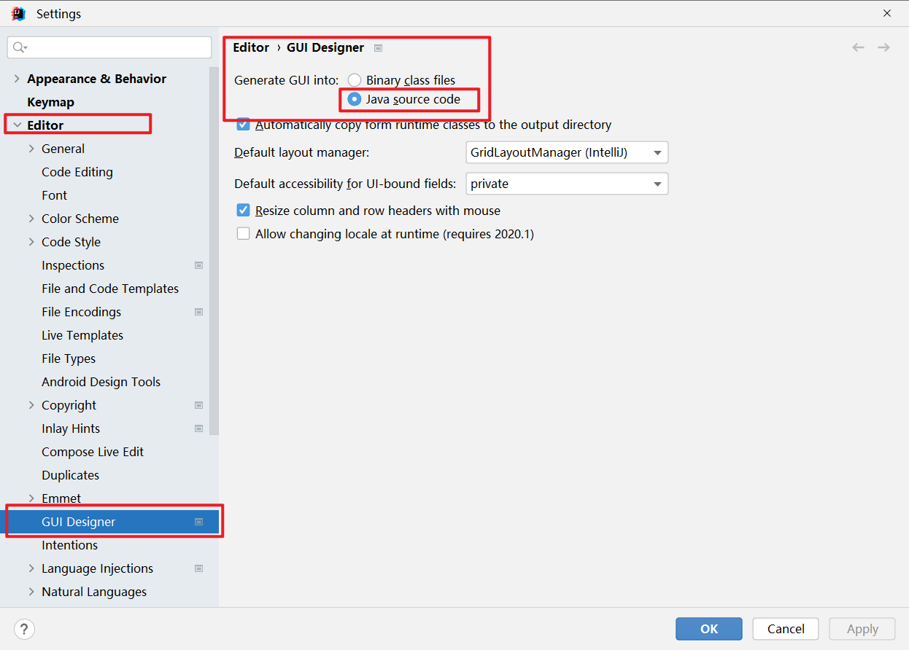
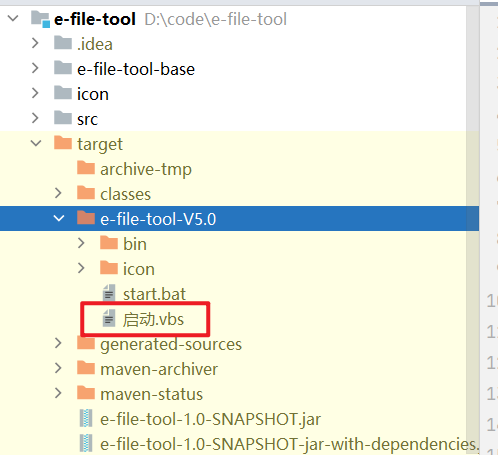
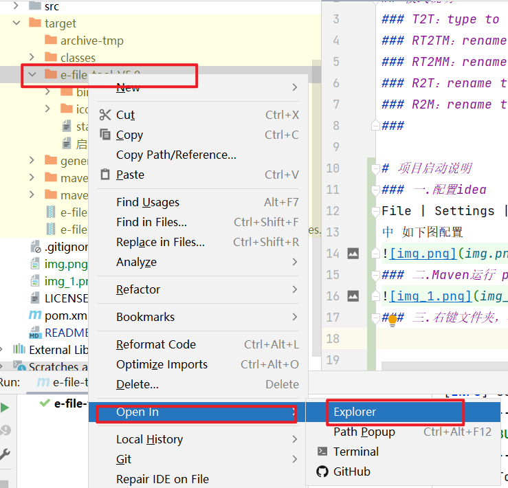
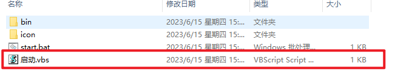
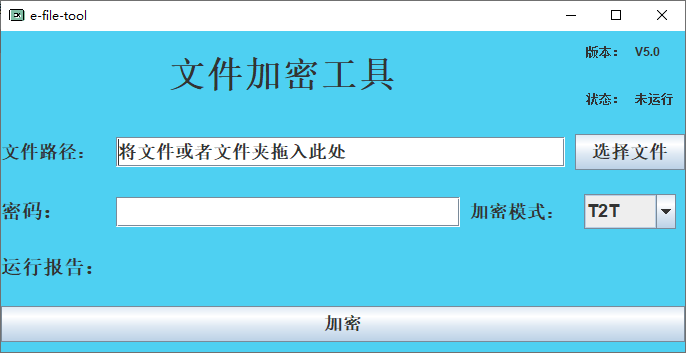

# 加密工具 
## 模式说明
### T2T：type to type 文件类型不变
### RT2TM：rename type to Time mp4 文件改为MP4文件 文件名为时间戳 解密后会恢复原有名字
### RT2MM：rename type to MD5 mp4 文件改为MP4文件 文件名为 32为 MD5 解密后会恢复原有名字
### R2T：rename to time 文件名改为时间戳  解密后会恢复原有名字 
### R2M：rename to MD5  文件名改为 MD5 解密后会恢复原有名字
### 

# 项目启动说明
### 一.配置idea
File | Settings | Editor | GUI Designer
中 如下图配置

### 二.Maven运行 package之后，找到target中

### 三.右键文件夹，在资源管理器中打开，直接双击运行即可

# 点个 star 吧！！！

